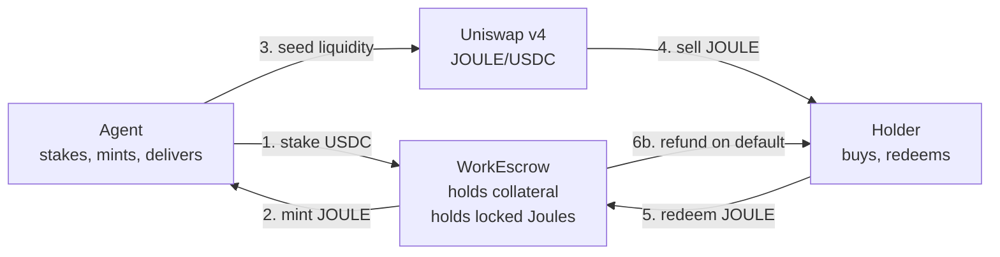
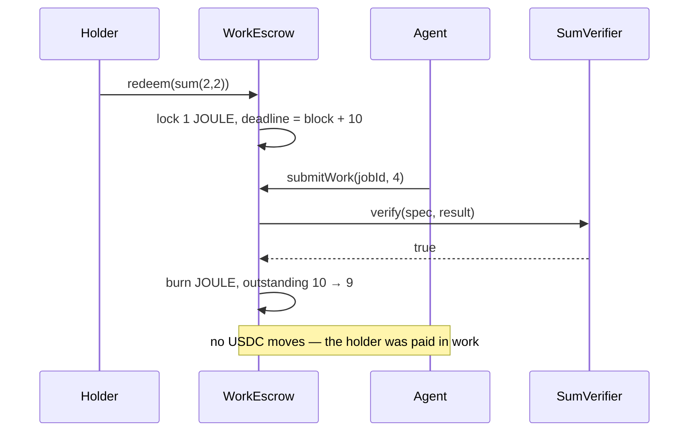
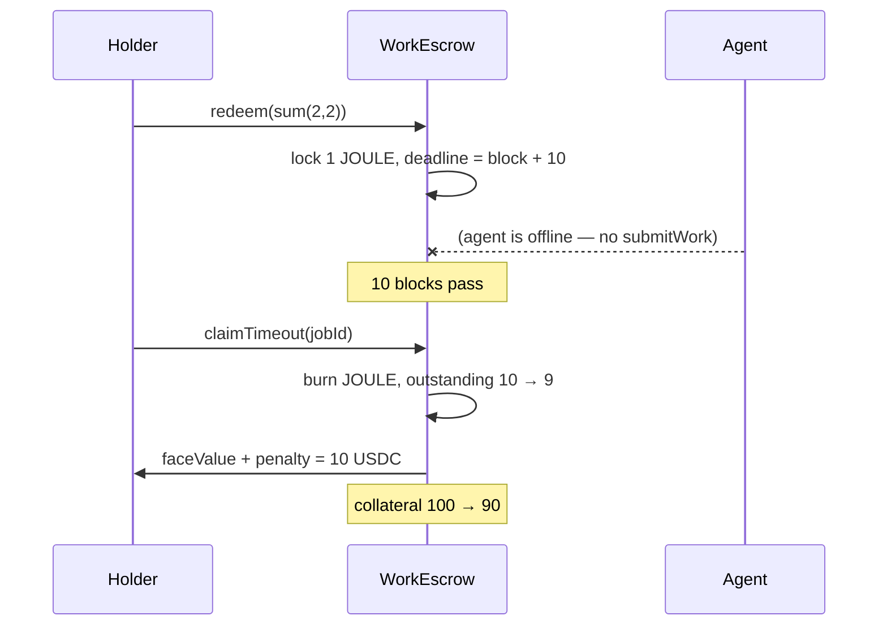
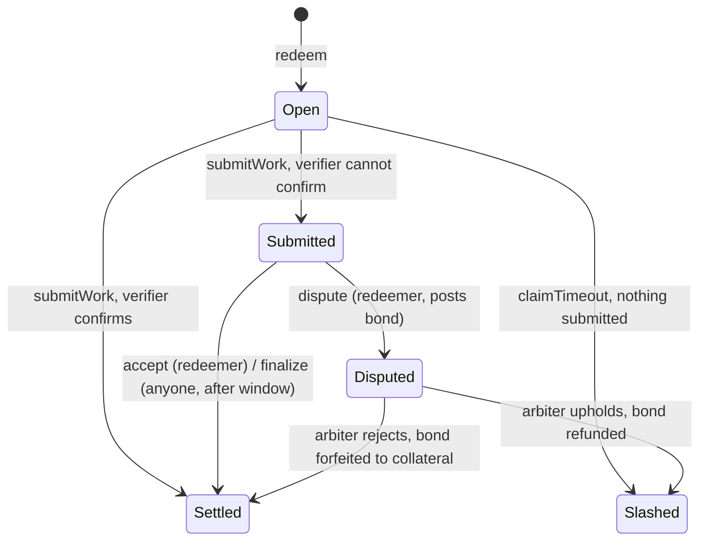

# Joule — Flow of Funds

Every unit below is USDC with **6 decimals**. `5 USDC` means `5_000_000` base units.

## What `faceValue` actually is

`faceValue` is **the agent's declared liability per Joule** — the sum they guarantee to refund if they fail to deliver. It is fixed when the escrow is deployed.

It is deliberately **not** the price. Three quantities get confused here, so state them separately:

| Quantity | Set by | Changes? | Where it appears |
|---|---|---|---|
| **`faceValue`** | Agent, at deployment | Never | Coverage requirement; default payout |
| **`penalty`** | Agent, at deployment | Never | Default payout only |
| **Market price** | The Uniswap pool | Continuously | Nowhere in the contracts |

The contracts never read the market price. This is the point of the design: `faceValue` is a *floor* the agent posts collateral against, and everything above it is discovered by the market. A Joule is a bond, not a receipt — par value fixed, price floating.

## Parameters used throughout

| Parameter | Value |
|---|---|
| `faceValue` | 5 USDC |
| `penalty` | 5 USDC |
| `coverageRatio` | 2× |
| `deliveryBlocks` | 10 (~2 min on Sepolia) |

## The cast



**Note step 4.** The buyer's USDC goes into the *pool*, never into the escrow. This single fact settles the revenue question — see the last section.

---

## Ledger, step by step

Agent starts with 150 USDC. Holder starts with 20 USDC.

### Setup

| # | Action | Agent | Escrow | Pool | Holder | `outstanding` |
|---|---|---|---|---|---|---|
| 0 | — | 150 USDC | 0 | — | 20 USDC | 0 |
| 1 | `stake(100 USDC)` | 50 USDC | **100 USDC** | — | 20 USDC | 0 |
| 2 | `issue(10)` | 50 USDC + **10 JOULE** | 100 USDC | — | 20 USDC | **10** |
| 3 | seed pool | 0 USDC, 0 JOULE, holds LP | 100 USDC | **50 USDC + 10 JOULE** | 20 USDC | 10 |
| 4 | holder swaps | *(LP position)* | 100 USDC | 55 USDC + 9 JOULE | 15 USDC + **1 JOULE** | 10 |

Step 2's coverage check: `100 ≥ 2 × 5 × 10 = 100` ✅ — exactly at the limit, so the agent cannot mint an eleventh Joule.

Step 3 costs the agent 50 USDC of their own liquidity. A concentrated single-sided range (JOULE only, priced above spot) would avoid that and is the capital-efficient version — this is what the stretch-goal v4 hook automates.

### Redemption starts

| # | Action | Escrow | Holder | `outstanding` |
|---|---|---|---|---|
| 5 | `redeem(jobSpec)` | 100 USDC + **1 JOULE (locked)** | 15 USDC, 0 JOULE | 10 |

The Joule is transferred *into* escrow custody. That is the lock — no flag on the token is needed, because a token the escrow holds cannot be moved by anyone else. Deadline is set at `block.number + 10`.

### Path A — delivered



| After | Agent | Escrow | Holder | `outstanding` | Required collateral |
|---|---|---|---|---|---|
| accept | *(LP position)* | 100 USDC | 15 USDC | **9** | `2 × 5 × 9` = **90** |

Collateral is untouched, but the requirement dropped to 90 — so **10 USDC is now unstakeable**. That is the agent's reward for delivering: capital released, not cash transferred. They were already paid, back at step 4, by the pool.

### Path B — timeout



| After | Agent | Escrow | Holder | `outstanding` | Required collateral |
|---|---|---|---|---|---|
| timeout | *(LP position)* | **90 USDC** | **25 USDC** | 9 | `2 × 5 × 9` = **90** |

The holder paid 5 for the Joule and received 10. The agent lost 10 of stake.

---

## The property that makes `coverageRatio = 2` non-arbitrary

Burning one Joule releases `coverageRatio × faceValue` = 10 USDC of requirement. One default costs `faceValue + penalty` = 10 USDC of collateral. **These are equal**, so the escrow lands exactly on its requirement after every default, and stays solvent through a total wipeout: an agent who defaults on all 10 Joules ends at 0 collateral, 0 outstanding.

That generalises to the solvency condition:

```
coverageRatio  ≥  (faceValue + penalty) / faceValue
```

With `penalty = faceValue` that is `≥ 2`. Raise the penalty to `2 × faceValue` and coverage must rise to 3× or the escrow can be drained before the last Joule is settled.

**Two levers, two jobs — don't conflate them:**

- **`coverageRatio` — solvency.** Can the escrow pay every possible default? Testable: `collateral ≥ coverageRatio × faceValue × outstanding`, always.
- **`penalty` — incentive.** Does the agent prefer delivering? Defaulting is unprofitable while `salePrice < faceValue + penalty`.

## What the token is actually worth — there is no enforced price floor

An earlier version of this document claimed a collateral-funded price floor: that anyone could buy a cheap Joule, redeem it, let it lapse and collect `faceValue + penalty`. **That is false, and it is worth understanding why, because it is the first thing a sharp reviewer will test.**

The redeemer cannot let it lapse. `submitWork` is `onlyAgent` and stays open for the whole delivery window, so **the agent chooses** between delivering and paying. A rational agent delivers whenever delivery costs less than `faceValue + penalty` — and with `SumVerifier` that is one transaction of gas. So an arbitrageur who buys at 4 USDC and redeems receives the sum of two numbers, not 10 USDC. No arbitrage, no bid, no floor.

What the contract actually guarantees is a **redeemer's option that the agent gets to answer**:

> the redeemer receives, at the agent's choice, **either the work or `faceValue + penalty`**

So the value of an unredeemed Joule is `min(what the work is worth to that particular holder, faceValue + penalty)` — and for a holder who does not want the work, that is approximately zero. A Joule is only worth what it is worth *to you*.

`penalty` is therefore not a price support. It is a **cap on the agent's cost of non-delivery**, which bounds how bad the work is allowed to be before walking away becomes cheaper than doing it. That is a real and useful guarantee — it is simply a different one.

The honest one-liner: **the downside is bounded, the upside is discovered.**

## Seeding the pool — why it needs only one token

Step 3 of the ledger costs the agent 50 USDC of their own liquidity on top of 100 USDC of collateral: 150 USDC committed to sell 50 USDC of work. That is a v2-shaped assumption, and v4 does not require it.

**In Uniswap v2**, liquidity spans every price from 0 to ∞. Because the pool might trade anywhere, you must be ready on both sides — so you deposit both tokens.

**In v3/v4** you choose a range `[Pa, Pb]` and your liquidity exists only inside it. Which means:

| Where spot sits | What the position holds |
|---|---|
| Below the range | **100% token0** |
| Inside the range | a mix, shifting as price moves |
| Above the range | **100% token1** |

Place a range **entirely above spot** and the position is 100% JOULE the moment it opens — **zero USDC deposited**. As buyers push price up through the range, JOULE sells off progressively and USDC accumulates in its place. This is a **range order**: a limit sell expressed as liquidity.

### Concretely

- Initialize the pool at 4.90 USDC/JOULE
- Add all 10 JOULE across `[4.90, 6.00]` — starting **at** spot, not above it
- Supply no USDC

Buyers fill against the agent's inventory immediately. By 6.00 all ten Joules are sold and the position is pure USDC.

Average execution is the **geometric** mean, not the arithmetic one: `√(4.90 × 6.00) ≈ 5.42`. That falls straight out of the concentrated-liquidity math — sweeping a full range converts `L(1/√Pa − 1/√Pb)` of token0 into `L(√Pb − √Pa)` of token1, and the ratio simplifies to exactly `√(Pa·Pb)`.

The range starts exactly at spot rather than above it, and that detail is load-bearing — see the third gotcha below. At the boundary the position still holds precisely zero USDC, because `L(√P − √Pa)` is zero when `P = Pa`, so nothing about the zero-capital claim is given up.

| | Two-sided seed | Single-sided range |
|---|---|---|
| Collateral | 100 USDC | 100 USDC |
| Liquidity supplied | **50 USDC** + 10 JOULE | **0 USDC** + 10 JOULE |
| Total committed | 150 USDC | **100 USDC** |
| Sells at | ~5.00 flat | 5.00 → 6.00, avg ≈ 5.48 |

A third less capital, at a better average price, for the same sale.

### Three things that will bite

**Token ordering is by address, not by choice.** Uniswap sorts so `token0 < token1` numerically, so whether JOULE is token0 or token1 depends on the deployed addresses — and that flips which tick direction "above spot" means. Get it backwards and you place a *buy* wall where you meant a sell wall, which fills instantly against you. Since we deploy `JouleToken`, either branch on `address(joule) < address(usdc)` at deploy time, or mine a CREATE2 salt to force the ordering. **Assert the ordering in the deploy script rather than assuming it.**

**A single-sided range is a one-directional market.** With no liquidity below spot, nobody can sell a Joule back. Fine for demo step 2 (buy, watch price rise), but it breaks the should-have *"agent buys back own Joules below floor"*, and a chart that only goes up is a weaker story than a two-sided market. Supporting sells needs a second USDC-side range below spot — which costs USDC again.

**A gap at spot makes the pool invisible to routers.** This one cost us a Sepolia deployment to find. Place the sell range strictly *above* spot and the pool reports `getLiquidity() == 0` at the current tick — there is inventory, but none of it is *active*. Uniswap v4 itself does not care: a swap simply gaps to the nearest initialised tick and fills there, so every contract-level test passes. The **Uniswap Trading API refuses to quote it at all**, returning `404 ResourceNotFound`.

Confirmed by experiment on Sepolia: the identical pool, holding ~$70 of inventory, went from `404` to a working quote after minting a position spanning spot worth about five dollars. Aggregate depth barely moved. Thin is fine; a hole at spot is fatal.

The fix is to pin both ranges to the opening tick so they **meet** at spot with no gap. Note the asymmetry that makes this subtle: a position is active on the half-open interval `[tickLower, tickUpper)`, so of two ranges meeting at spot only the one pinned at its *lower* bound is live — and **which one that is flips with the token ordering**. Pinning only the sell wall works when JOULE is token0 and silently fails when it is token1.

### What the stretch-goal hook automates

A v4 hook runs contract logic on every swap. Rather than the agent pre-committing inventory into a static range, the hook can:

- **Mint on demand** as price crosses the ask — issuing just-in-time against live coverage headroom instead of pre-minting ten and hoping
- **Bid for its own inventory** — buying back Joules the agent is willing to retire, which frees `coverageRatio × faceValue` of collateral per Joule. Note this creates a bid the protocol does not otherwise have: as established above, nothing in the contracts puts a floor under the price, so any support is the agent choosing to provide it.
- **Route swap fees into collateral**, so trading activity raises coverage and therefore issuance capacity

The static single-sided range is that behaviour frozen at a single moment. The hook makes it responsive to the escrow's actual state.

## Settlement: two paths, chosen by the verifier

`redeem` refuses any spec the verifier cannot parse, and it is worth being precise about what that does and does not buy. It stops a holder opening a job whose spec is malformed — the griefing attack `isValidSpec` exists for. It does **not** mean every accepted job can be decided by an onchain function.

So settlement has two paths, and which one a job takes is decided by the verifier rather than by anyone's opinion:



**Verified path.** The verifier confirms the result and the job settles inside `submitWork`. No window, no counterparty, no delay. `sum(2,2)` takes this path, and so would a zk-proof verifier.

**Optimistic path.** The verifier cannot confirm. The job enters an acceptance window: the redeemer may accept early, challenge it, or do nothing — in which case anyone may finalize once the window closes. This is what lets the escrow take work no onchain function can adjudicate.

### Why the challenge half is not optional

Two designs look simpler and both are broken:

**Auto-accept with no challenge.** Submitting *anything* stops the timeout clock. An agent would send one garbage byte, wait out the window, and settle — the penalty would become unreachable for exactly the jobs the optimistic path exists to support. `test_SubmittingAnythingBlocksTheTimeout` pins the mechanic this defends against.

**An unbonded right of refusal.** If the redeemer can simply reject and trigger the slash, they reject everything and collect `faceValue + penalty` on every job. Deliver-then-refuse becomes free money.

The bond resolves both. Challenging costs `penalty`, refunded if the arbiter agrees and forfeited into the agent's collateral if it does not. Bonds are tracked in `disputeBonds`, separate from `collateral`, because a posted bond is not the agent's money.

### The arbiter is the trust assumption — name it

A single immutable address rules on any disputed job. It cannot mint, cannot touch collateral outside a dispute, and cannot be replaced — but within a dispute its word is final. **This is the most centralised thing in the system** and a CROPS review should flag it.

It is here because subjective quality cannot be settled trustlessly by the two parties alone: any scheme where one side judges is exploitable by that side. Decentralising it means Kleros, UMA, or a committee — out of scope for this build.

### The narrower claim this forces

The README says *"the SI unit of AI agent work"*. The verified path covers **objectively checkable** work; everything else falls to an optimistic path whose backstop is a single trusted address. That is a real limitation and worth stating before someone else does.

The route out is not better arbitration — it is a better verifier. `IVerifier` is an interface, and `SumVerifier` is one trivial implementation:

- **zk proofs.** The agent works offchain and submits a proof; the verifier checks it. Arbitrary computation becomes objectively verifiable with no human anywhere. Noir is the obvious tool.
- **Property verifiers** — a signature, a Merkle inclusion, a committed-output hash, a deterministic transform.
- **Optimistic + arbiter** — the fallback when nothing above fits, which is what ships here.

The architecture anticipates this because settlement is delegated to a swappable interface rather than hardcoded. Every job moved from the optimistic path to the verified path is one less thing the arbiter can get wrong.

## Limits — where this breaks, and the path past it

The mechanism is correct as specified, but it has a stated operating range. Both bounds below are real; neither is fixed in this build.

### Limit 1 — the agent walks away when the work is expensive

Solvency always holds: the collateral pays out exactly as designed. What can fail is the agent *wanting* to deliver.

The decision rule is one line, and the market price is not in it:

> the agent defaults iff **`cost_of_delivery > faceValue + penalty`**

Sale proceeds are banked either way — the Joules were sold before any of this, and that money is already the agent's. So the price is *sunk* at decision time. What remains is a straight comparison between doing the work and paying the penalty.

An earlier version of this section scored "+200 USDC for delivering nothing" against a baseline of inaction, which is the wrong comparison. Against the right baseline:

| At a pool price of 30, the agent has already banked +300 either way | |
|---|---|
| **Deliver** — cost of a `SumVerifier` job ≈ gas, collateral returns | **≈ 0** |
| **Default** — pays 10 × (5 + 5) from collateral | **−100** |
| **Defaulting is worse by 100.** | |

So a high price does *not* tempt the agent to default. That is a strictly better property than previously claimed. The real exposure is the opposite one: **work that costs more than `faceValue + penalty` to perform.** Set the penalty too low relative to the job's real cost and the agent rationally pays it instead of working — for every job, forever.

### Buyer protection is a separate claim — don't weld them together

There *is* a bound involving market price, but it protects the **buyer**, not the agent's incentive:

> a holder who paid `P` recovers at most `faceValue + penalty` if the agent defaults

At `P = 30` and `faceValue + penalty = 10`, twenty of that is unsecured. This is normal for a bond trading above its recovery value — but it must be disclosed rather than dressed up as a floor. The two claims share the same symbols and nothing else; deriving one from the other, as an earlier version did, does not hold.

### Limit 2 — capital is locked from mint to burn, not just during delivery

The delivery window is ~2 minutes, which makes the collateral lock sound short. It isn't. A Joule sitting unredeemed in someone's wallet keeps counting toward `outstanding` indefinitely, and the holder alone decides when to redeem. The agent cannot reclaim that capital by waiting.

This is the more practical of the two limits: it caps concurrent exposure, not lifetime volume, and the binding quantity is *Joules in circulation × time*.

### Limit 3 — the verifier is a total trust root

`IVerifier` is an immutable address set at deployment, and it decides both which jobs can be opened and which results settle. Two one-line implementations break the system completely:

| Rug | Effect |
|---|---|
| `isValidSpec` always returns false | Every Joule becomes permanently unredeemable. The agent keeps every sale proceed and can never be slashed, because no job can ever be opened. |
| `verify` always returns true | Every job settles on the first submission regardless of content. The optimistic path, the acceptance window and the dispute machinery are all bypassed. |

Neither is exploitable *after* deployment — the address cannot be changed — so this is a deployment-time trust decision, not a live attack surface. But it means **reading the verifier's source is not optional** for anyone evaluating a Joule. The escrow's guarantees are conditional on it.

Set against that: the escrow itself has no admin, no owner, no pause, and no upgrade path. The verifier is the single place where trust is required, which at least makes it easy to point at.

### Limit 4 — donated tokens are stranded

Tokens sent to the escrow outside `stake` or `dispute` are credited to no ledger and cannot be withdrawn by anyone, including the agent. This breaks no invariant — `collateral`, `disputeBonds` and `totalOwed` are all tracked independently of the balance, and the tests assert holdings only ever *exceed* the ledgers — but it is a one-way door.

No `skim()` is provided. Adding one means deciding who owns an unexplained balance, and every answer is worse than the rule "do not send tokens directly."

### Roadmap

| Mitigation | Attacks | Cost |
|---|---|---|
| **Buy back and retire** — agent buys a Joule on the pool and retires it, freeing coverage | Limit 2 | **Already works, no new code.** The agent buys on the pool, calls `redeem` (permissionless — nothing stops the agent being the redeemer), then `submitWork` on their own job, which passes `onlyAgent` because they *are* the agent. Two transactions: `outstanding--`, the Joule burns, `coverageRatio × faceValue` is freed. An emergent property of permissionless redemption, not a roadmap item. |
| **Expiry** — unredeemed Joules can be voided after N blocks, releasing collateral | Limit 2 | Medium; needs refund semantics and weakens the holder's position. |
| **Raise `penalty` above the true cost of the work** | Limit 1 | The direct fix, and the only one that addresses the actual failure mode. Solvency then forces `coverageRatio` up in step, so it is paid for in locked capital. |
| **Repeat play + costly identity** | Limit 1 | An agent who defaults ends with less collateral and therefore less issuance capacity — repeated defaults destroy the franchise. That only fails if becoming a *new* agent is cheap, which is a Sybil problem, not a collateral problem. **ERC-8004** onchain agent identity is where identity is made expensive. |
| **Mutable `faceValue` / `penalty`** — agent may raise them, topping up collateral to match | Limit 1 | Small, and more useful now: it lets the agent re-price the walk-away option as they learn what jobs actually cost. |

None of these are in this build. The honest position is that the operating range is known and documented, rather than discovered under questioning.

## Why revenue cannot be "held"

Look again at step 4. The holder's USDC goes into the **Uniswap pool**, and the agent captures it through their LP position. It never enters the escrow.

An escrow cannot hold what it never receives. "Hold revenue until delivery" could only ever govern a *primary* sale — the escrow selling Joules directly — and once a pool exists, that path is redundant with it. Building both would mean explaining why the guarantee applies to one sales channel and not the other.

So: **sale proceeds are the agent's on receipt, and the collateral is the sole guarantee.** One rule, identical for every channel. What protects the buyer is not custody of the purchase price — it is the stake, sized by `coverageRatio` and made painful by `penalty`.

---

## Prior art

Two projects have already tokenised an agent or a person. Both are instructive, and neither enforces delivery onchain — which is the entire gap Joule is built into.

### Virtuals Protocol — Initial Agent Offering

[The IAO](https://whitepaper.virtuals.io/about-virtuals-1/the-protocol/virtual-agents-as-programmable-decentralized-entities/initial-agent-offering-mechanism) launches an agent with a fixed 1B-token supply. A creator pays 100 $VIRTUAL to open a bonding curve; at ~41.6k $VIRTUAL accumulated the agent "graduates" into a $VIRTUAL-paired liquidity pool locked for ten years. Post-graduation a 1% trading tax splits 30% creator / 20% affiliates / 50% Agent SubDAO.

The whitepaper page describes no backing, no redemption, and no default or slashing logic. That is not an omission — those concepts don't exist in the IAO. **Value accrues from trading volume, not delivery.** An agent that produces nothing but sustains churn still pays its creator.

Two places the designs directly conflict:

- **Virtuals taxes speculation; Joule refuses to touch the sale.** The 1% tax makes the token earn from its own churn. Joule takes the opposite position — sale proceeds are the agent's on receipt, the escrow never sees them, and the stake is the only guarantee. One rule per channel instead of a fee carve-out.
- **Fixed 1B vs. supply-as-a-consequence.** Virtuals' supply is a launch decision. Joule's is a solvency output: the eleventh Joule cannot be minted if collateral doesn't cover it. Boring cap table by construction, structurally bounded market cap.

Virtuals also uses the bonding curve as price discovery and an anti-rug device. Joule has no launch curve — it opens with a single-sided v4 range order, because **the collateral already does the job the curve approximates**.

### Orb — Harberger-taxed right to invoke a person

[Orb](https://orb.land/) ([contracts](https://github.com/orbland/contracts)) is the closer analogue, and the more useful failure. A single NFT grants its keeper the recurring right to invoke its creator — ask a question, receive an answer — with a `cooldown` (default `7 days`) between invocations. Ownership is Harberger-taxed: the keeper self-assesses a price, anyone may buy at that price, and tax streams to the creator every block. [Eric Wall's Orb](https://www.theblock.co/post/236422/eric-walls-unique-consulting-nft-is-relinquished-amidst-300-tax-burden) charged 25% monthly — ~300% annualised.

**The obligation is a promise, not a mechanism.** The contract has `honoredUntil` and `responsePeriod`, but `responsePeriod` is metadata: no collateral, no penalty, no foreclosure, no tax suspension if the creator simply never answers. Enforcement is entirely reputational. Eric's Orb was released April 2023; its sole holder [relinquished it under the tax burden](https://www.theblock.co/post/236422/eric-walls-unique-consulting-nft-is-relinquished-amidst-300-tax-burden), and [Orb Land shut down](https://protos.com/orb-land-shutdown-proves-almost-no-one-cares-about-nft-utility/).

The mechanical inversion is worth stating plainly:

> **Orb's holder pays to hold. Joule's holder is paid to hold.**

An Orb keeper bleeds ~300%/yr for the privilege of holding a claim. A Joule's carrying cost falls on the *agent* instead, whose collateral stays locked from mint until the holder chooses to redeem. Joule's Limit 2 is exactly Orb's carrying cost, moved to the side of the table that has something to lose by it — and can end it by delivering.

Two more differences that matter:

- **Perpetual and non-fungible vs. consumable and fungible.** An Orb is one claim, one holder, resold forever. A Joule is one claim, one job, burned on settlement. Fungibility plus burn-on-settle is what lets supply track collateral instead of being fixed.
- **Harberger solves a problem Joule punts on.** The tax is a real answer to pricing a right whose value is idiosyncratic to whoever holds it. Joule hands that to an AMM, which works because a Joule's value is roughly the same to everyone — a fair trade only because the jobs are objectively specified.

### Where the three land

| | Virtuals IAO | Orb | Joule |
|---|---|---|---|
| The asset | Fungible share of an agent's fee stream | Non-fungible perpetual right to invoke | Fungible one-shot claim on one job |
| Backed by | Nothing | Nothing | USDC, over-collateralised |
| Delivery obligation | None | Social — `responsePeriod` is metadata | Onchain — verifier, then slash |
| Cost of non-delivery | None | Reputation | `faceValue + penalty` per Joule |
| Who carries the cost of holding | Holder (drawdown) | Holder (~300%/yr Harberger tax) | **Agent** (locked collateral) |
| Downside protection | None | None | `faceValue + penalty`, if the agent defaults |
| Issuer earns from | 30% of a 1% trading tax | Harberger tax stream | Sale proceeds, via the pool |

### What Joule is actually betting

Neither prior project failed for want of demand for agent tokens. They differ from Joule on one axis: whether the claim is **enforceable without trusting the issuer**. Virtuals imports that trust socially — $VIRTUAL pairing, creator reputation, repeat play — and enforces none of it onchain. Orb wrote the obligation into a variable and left it unenforced.

Joule enforces, and pays for it in capital efficiency. For a buyer to be made whole when an agent defaults, `faceValue + penalty` has to be worth at least what they paid — so collateral per outstanding Joule has to exceed market price per Joule. That ceiling is exactly what the other two escape by backing nothing: a claim with no redemption has nothing to keep solvent. The three are not comparable on market cap, and shouldn't be compared on it. **ERC-8004 costly identity is the bridge** — it is how the trust Virtuals imports socially gets priced onchain, and it is what would let coverage fall below 1× price honestly.

In one line: an IAO token is a bet that an agent *will be valuable*; an Orb is a promise that a person *will reply*; a Joule is a receipt that an agent *owes you work, or 10 USDC*.
