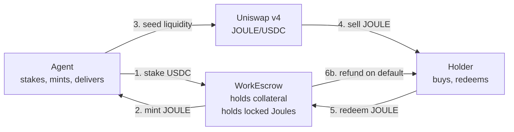
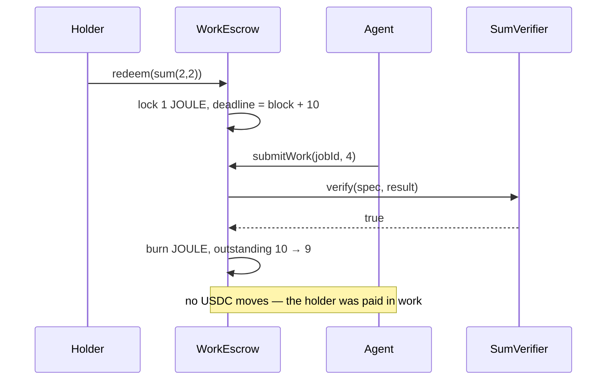
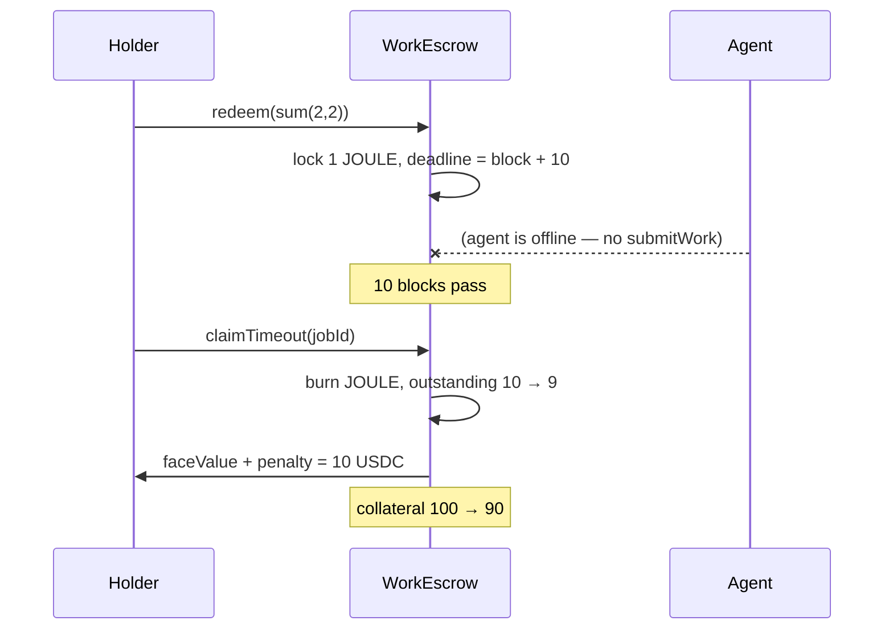

# Joule — Flow of Funds

Every unit below is USDC with **6 decimals**. `5 USDC` means `5_000_000` base units.

## What `faceValue` actually is

`faceValue` is **the agent's declared liability per Joule** — the sum they guarantee to refund if they fail to deliver. It is fixed when the escrow is deployed.

It is deliberately **not** the price. Three quantities get confused here, so state them separately:

| Quantity | Set by | Changes? | Where it appears |
|---|---|---|---|
| **`faceValue`** | Agent, at deployment | Never | Coverage requirement; default payout |
| **`penalty`** | Agent, at deployment | Never | Default payout only |
| **Market price** | The Uniswap pool | Continuously | Nowhere in the contracts |

The contracts never read the market price. This is the point of the design: `faceValue` is a *floor* the agent posts collateral against, and everything above it is discovered by the market. A Joule is a bond, not a receipt — par value fixed, price floating.

## Parameters used throughout

| Parameter | Value |
|---|---|
| `faceValue` | 5 USDC |
| `penalty` | 5 USDC |
| `coverageRatio` | 2× |
| `deliveryBlocks` | 10 (~2 min on Sepolia) |

## The cast



**Note step 4.** The buyer's USDC goes into the *pool*, never into the escrow. This single fact settles the revenue question — see the last section.

---

## Ledger, step by step

Agent starts with 150 USDC. Holder starts with 20 USDC.

### Setup

| # | Action | Agent | Escrow | Pool | Holder | `outstanding` |
|---|---|---|---|---|---|---|
| 0 | — | 150 USDC | 0 | — | 20 USDC | 0 |
| 1 | `stake(100 USDC)` | 50 USDC | **100 USDC** | — | 20 USDC | 0 |
| 2 | `issue(10)` | 50 USDC + **10 JOULE** | 100 USDC | — | 20 USDC | **10** |
| 3 | seed pool | 0 USDC, 0 JOULE, holds LP | 100 USDC | **50 USDC + 10 JOULE** | 20 USDC | 10 |
| 4 | holder swaps | *(LP position)* | 100 USDC | 55 USDC + 9 JOULE | 15 USDC + **1 JOULE** | 10 |

Step 2's coverage check: `100 ≥ 2 × 5 × 10 = 100` ✅ — exactly at the limit, so the agent cannot mint an eleventh Joule.

Step 3 costs the agent 50 USDC of their own liquidity. A concentrated single-sided range (JOULE only, priced above spot) would avoid that and is the capital-efficient version — this is what the stretch-goal v4 hook automates.

### Redemption starts

| # | Action | Escrow | Holder | `outstanding` |
|---|---|---|---|---|
| 5 | `redeem(jobSpec)` | 100 USDC + **1 JOULE (locked)** | 15 USDC, 0 JOULE | 10 |

The Joule is transferred *into* escrow custody. That is the lock — no flag on the token is needed, because a token the escrow holds cannot be moved by anyone else. Deadline is set at `block.number + 10`.

### Path A — delivered



| After | Agent | Escrow | Holder | `outstanding` | Required collateral |
|---|---|---|---|---|---|
| accept | *(LP position)* | 100 USDC | 15 USDC | **9** | `2 × 5 × 9` = **90** |

Collateral is untouched, but the requirement dropped to 90 — so **10 USDC is now unstakeable**. That is the agent's reward for delivering: capital released, not cash transferred. They were already paid, back at step 4, by the pool.

### Path B — timeout



| After | Agent | Escrow | Holder | `outstanding` | Required collateral |
|---|---|---|---|---|---|
| timeout | *(LP position)* | **90 USDC** | **25 USDC** | 9 | `2 × 5 × 9` = **90** |

The holder paid 5 for the Joule and received 10. The agent lost 10 of stake.

---

## The property that makes `coverageRatio = 2` non-arbitrary

Burning one Joule releases `coverageRatio × faceValue` = 10 USDC of requirement. One default costs `faceValue + penalty` = 10 USDC of collateral. **These are equal**, so the escrow lands exactly on its requirement after every default, and stays solvent through a total wipeout: an agent who defaults on all 10 Joules ends at 0 collateral, 0 outstanding.

That generalises to the solvency condition:

```
coverageRatio  ≥  (faceValue + penalty) / faceValue
```

With `penalty = faceValue` that is `≥ 2`. Raise the penalty to `2 × faceValue` and coverage must rise to 3× or the escrow can be drained before the last Joule is settled.

**Two levers, two jobs — don't conflate them:**

- **`coverageRatio` — solvency.** Can the escrow pay every possible default? Testable: `collateral ≥ coverageRatio × faceValue × outstanding`, always.
- **`penalty` — incentive.** Does the agent prefer delivering? Defaulting is unprofitable while `salePrice < faceValue + penalty`.

## Why the market price sits above `faceValue + penalty`

If a Joule traded below 10 USDC, anyone could buy it, redeem it, let it lapse and collect 10. That arbitrage puts a **hard floor under the token, funded by collateral**. Above the floor, price is the market's read on how likely the agent is to deliver and how much that work is worth.

That is the thesis in one line: **the floor is enforced, the premium is discovered.**

## Why revenue cannot be "held"

Look again at step 4. The holder's USDC goes into the **Uniswap pool**, and the agent captures it through their LP position. It never enters the escrow.

An escrow cannot hold what it never receives. "Hold revenue until delivery" could only ever govern a *primary* sale — the escrow selling Joules directly — and once a pool exists, that path is redundant with it. Building both would mean explaining why the guarantee applies to one sales channel and not the other.

So: **sale proceeds are the agent's on receipt, and the collateral is the sole guarantee.** One rule, identical for every channel. What protects the buyer is not custody of the purchase price — it is the stake, sized by `coverageRatio` and made painful by `penalty`.
